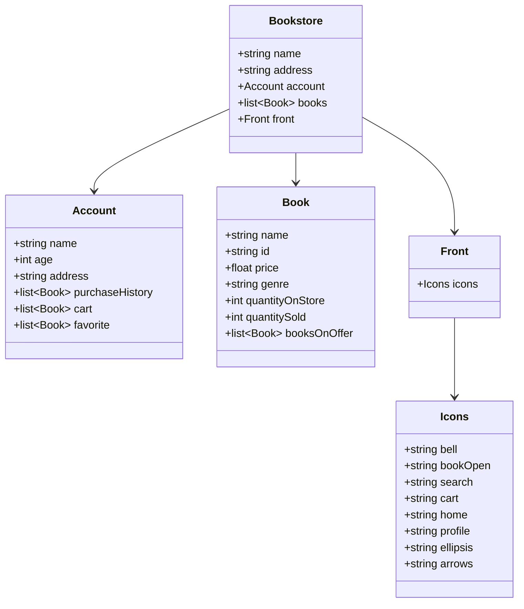

# Projeto: Publicando Sua API REST na Nuvem Usando Spring Boot, Java 21 e Railway
## Figma e representação visual
O Figma foi utilizado para a abstração do domínio desta API, sendo útil na análise e projeto da solução.
Acesse a representação: [BookStore](https://www.figma.com/design/RBnvNT1wRCB1HQ6ri10mKA/Library?node-id=0-1&t=DDJ9a7llpA7zOfOs-1)
## Status
Em desenvolvimento
## Foco de aprendizagem
Spring Framework com Spring Boot, API REST, Railway e Gerenciamento com Gandle.
## Diagrama de Classe Da API em desenvolvimento - Sistema de uma Livraria

## Uso e tecnologias utilizadas
A produção do projeto em questão se limita ao uso do Framework Spring, mais especificamente Spring Boot, alguma IDE (Integrated Development Environment ou Ambiente de Desenvolvimento integrado) da linguagem Java, nesse caso a IDE Eclipse e as tecnologias básicas Eclipse e Java. Ademais, utilizou-se algumas dependências naturais ou não do próprio framework.

  

## Contribuição
Se deseja melhorar o projeto de maneira a aprofundar o aprendizado sobre novas formas de se trabalhar a proposta Conta bancária em BackEnd Java, é possível executar as funções de Issues, Pull requests e Fork na plataforma do GitHub.

Saiba mais em: [Contribuições](https://docs.github.com/pt/get-started/exploring-projects-on-github/contributing-to-a-project)

## Conecte-se comigo

